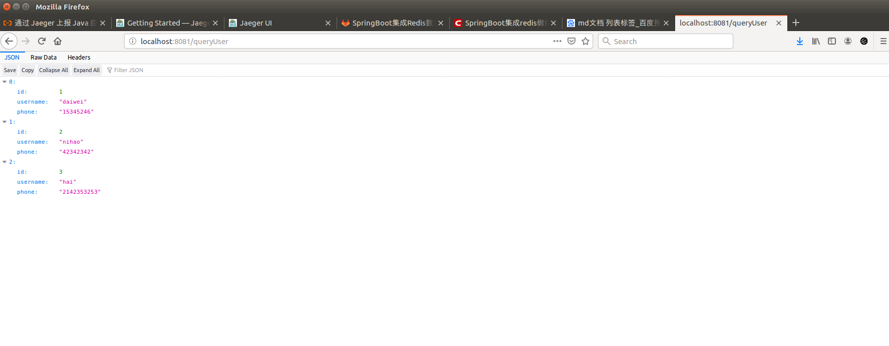
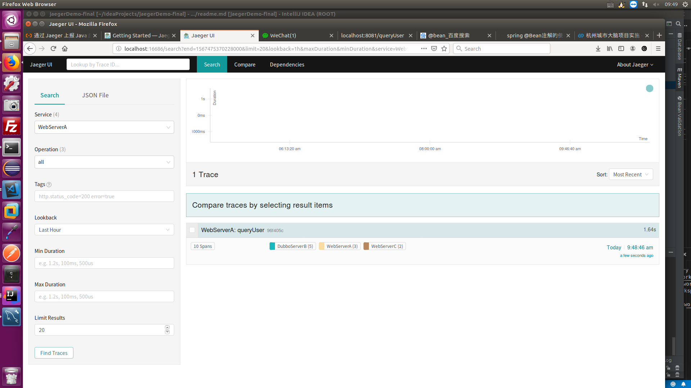
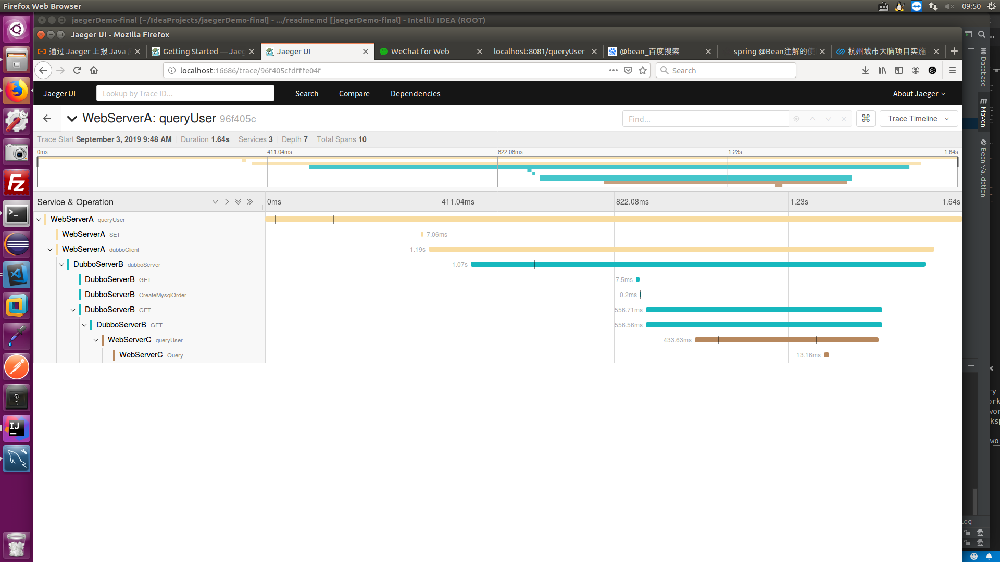
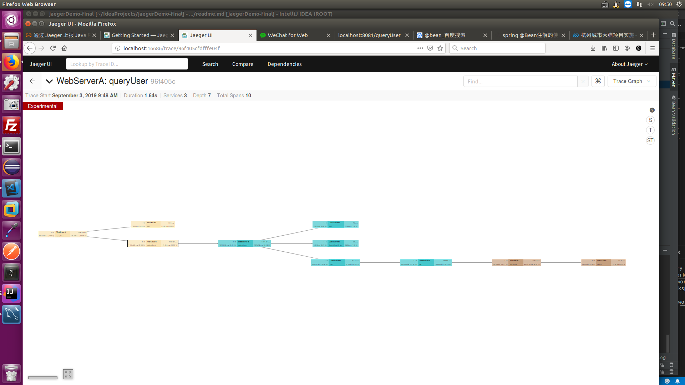

# springboot接入jaeger方案Demo程序

## 准备工作

1.安装mysql，并创建数据库springboot_db，创建表users，任意插入一条数据（密码为parking，可根据自身数据库参数，修改配置文件）。
2.安装redis（密码为pakring，可根据自身redis参数修改配置文件）。
3.安装docker。
4.运行jaeger中[all-in-one](https://www.jaegertracing.io/docs/1.13/getting-started/#all-in-one)试例程序。

## 启动Demo程序

先启动WebServerC，在启动WebServerB，最后启动WebServerA。

## 测试

打开浏览器，输入`http://localhost:8081/queryUser`，结果如下图所示：

输入`http://localhost:16686`,Service中选择WebServerA。点击`Find Traces`按钮，看到追踪效果图如下

